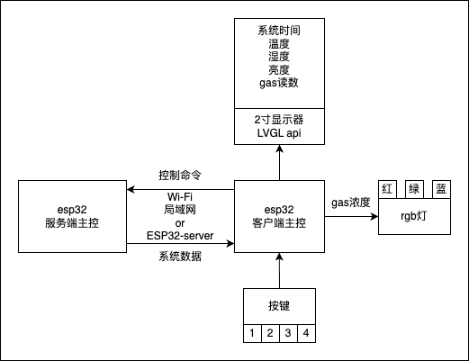

# ESP32 Home Client 需求说明

## 1、设备功能与接线

| 设备          | 接线方式 | 功能描述         |
| ------------- | -------- | ---------------- |
| rgb-r         |          | 气体安全值指示灯 |
| rgb-g         |          | 气体安全值指示灯 |
| rgb-b         |          | 气体安全值指示灯 |
| 旋钮          |          | 窗帘与风扇控制   |
| 2寸显示器     |          |                  |
| lcd1602显示器 |          |                  |

## 2、功能说明
### 2.1 气体安全值指示灯
- **功能描述**：根据检测到的气体浓度，RGB灯会显示不同的颜色来指示安全状态。
  - 绿色：气体浓度安全
  - 黄色：气体浓度较高，需注意
  - 红色：气体浓度危险，需立即采取措施
### 2.2 窗帘与风扇控制
- **功能描述**：
- 1. 默认状态下，旋钮控制窗帘的开合程度，顺时针旋转为打开，逆时针旋转为关闭。
- 2. 当按下旋钮时，进入风扇控制模式，此时旋钮控制风扇的转速，顺时针旋转为增加转速，逆时针旋转为降低转速。

## 3、开发说明
此项目为esp32-home项目的客户端版本，主要负责接收服务器发送的气体浓度数据，并根据数据控制RGB灯的颜色显示。同时，通过按键和旋钮实现对家电设备的控制。开发过程中需要注意以下几点：
- 确保ESP32与服务器之间的通信稳定，使用与esp32相同的局域网Wi-Fi或者esp32-server提供的热点。
- 在编写代码时，合理使用GPIO引脚，避免冲突。
- 对于控制功能，是向服务器发送控制指令，需要根据实际需求进行设计和实现。
- 详情请参考 [对接文档](../shared/对接文档.md)

## 4、项目架构

## 5、硬件细节

- 主控：ESP32
- RGB灯：单色RGB灯*3
- 按键：4个按键
- 旋钮：1个旋钮（5pin）
- 显示器：2寸显示器（2.0 TFT 8pin）BL CS DC RST SDI SCK LED VCC GND
- 显示器：lcd1602显示器（1602 LCD 4pin）