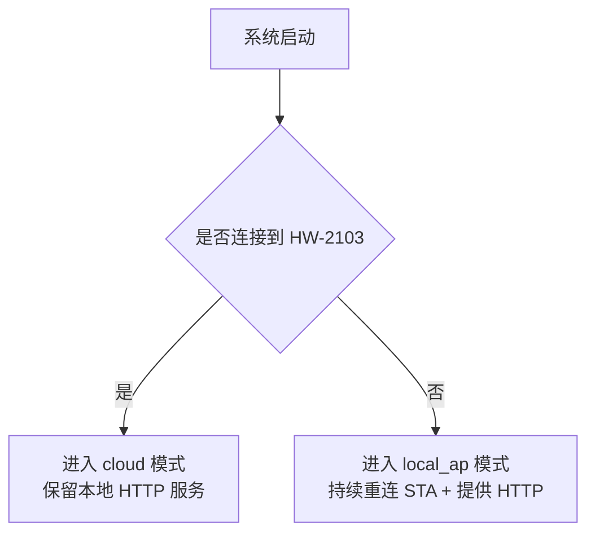

## 1. 接线与基础约束

参考 `include/pins.h` 实现接线，当前有效引脚如下：

- 传感器：DHT(GPIO13)、光照 AO(GPIO4)、MQ2 AO(GPIO5)、雨滴 AO(GPIO6)
- 执行器：风扇 PWM(GPIO18)、窗帘舵机 A/B(GPIO16/GPIO17)、蜂鸣器(GPIO12)

当前版本约束：

- 温湿度传感器按 DHT11 实现，支持失败重试与缓存回退。
- 风扇为 PWM 调速链路，不是机械继电器式调速。
- 窗帘采用双舵机反向联动，动作后自动 detach 降低抖动。

## 2. 外部连接功能

1. 优先连接家庭 Wi-Fi：`HW-2103 / 20220715`
2. 无法连接家庭 Wi-Fi 时进入 `local_ap`，热点：`esp32-server / lbl450981`
3. 当前交付主链路是本地 HTTP；MQTT 作为并行能力保留，不作为客户端联调前置

功能示意：

要求：

- 网络状态变化时自动切换模式。
- `/`、`/api/status`、`/api/control` 在可访问网络路径上可用。

## 3. 设备驱动实现

### 3.1 传感器功能

实现 `src/Sensor.cpp` 与 `include/Sensor.h`：

- 温湿度（DHT）
- 光照百分比
- MQ2 百分比
- 雨滴百分比

要求：

- 默认采样周期 0.5 秒。
- 统一整理为 `StandardSensorData`。
- 异常时保留 `error` 与 `errorMessage`，并输出 `sensorReadStatus`。

### 3.2 控制器功能

实现 `src/Controllerr.cpp` 与 `include/Controllerr.h`：

- 风扇档位与百分比调速
- 窗帘角度与预设
- 蜂鸣器非阻塞报警

## 4. 协议与功能实现

### 4.1 状态接口

- `GET /api/status`
- 每 0.5 秒形成最新采样快照并可对外读取。
- 返回平铺字段 + `sensor`/`controller` 分组字段。

状态至少应包含：

- 传感器：`temperatureC`、`humidityPercent`、`lightPercent`、`mq2Percent`、`rainPercent`、`isRaining`、`smokeLevel`
- 控制器：`fanMode`、`fanSpeedPercent`、`curtainAngle`
- 元信息：`mode`、`ip`、`sensorTimestamp`、`error`、`errorMessage`

### 4.2 控制接口

- `POST /api/control`
- 统一 JSON 请求与 JSON 响应：`ok/stateChanged/type/message`

当前有效控制能力：

1. `{"device":"curtain","angle":0-180}`
2. `{"device":"curtain","preset":0-4}`
3. `{"device":"fan","mode":"off|low|medium|high"}`
4. `{"device":"fan","speedPercent":0-100}`

说明：

- 当前协议不支持 `{"device":"fan","power":"on|off"}`。
- 本地网页与 ESP32 客户端均使用同一控制接口。

### 4.3 自动化

1. 时间窗帘：
   - 07:00 预设全开
   - 22:00 预设全关
2. 温度联动：
   - >=32 摄氏度触发风扇高档
   - <=29 摄氏度退出高温增强
3. 烟雾联动：
   - MQ2 >=75% 自动风扇高档
   - MQ2 >=90% 周期短鸣
4. 雨滴联动：
   - 下雨进入锁定并触发关窗帘
   - 雨停稳定后释放锁并全开窗帘
5. 光照联动：
   - 白天强光触发防眩预设
   - 带滞回与动作冷却，避免来回抖动

