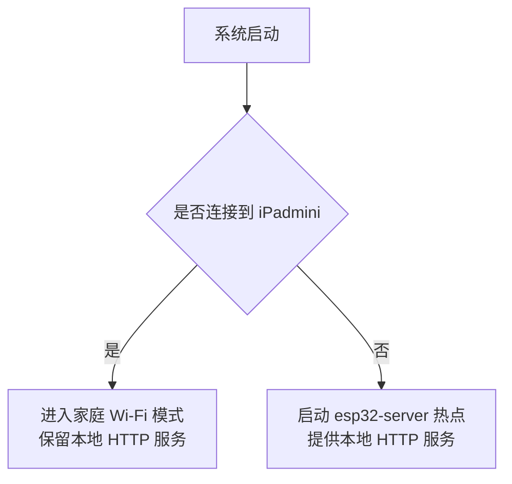

## 1. 接线与基础约束

参考项目接线图实现 `include/pins.h`，并保持引脚参数可配置，不要在驱动内部写死。

当前版本约束：
- 温湿度传感器优先按 DHT11 保留实现
- 排气扇由继电器/PWM 侧控制
- 窗帘由双舵机实现
- 红外控制不由 ESP32 直接发红外，而是通过串口把字符串命令发给外接 ESP8266

## 2. 外部连接功能

1. 使用家庭 Wi-Fi `iPadmini / lbl450981` 作为优先联网方式
2. 当家庭 Wi-Fi 不可用时，启动本地热点：
   - SSID：`esp32-server`
   - Password：`lbl450981`
3. 当前版本要求本地 HTTP 控制链路可用，MQTT 仅保留后续扩展接口，不作为当前交付主流程

功能示意：

要求：
- 网络状态变化时自动切换模式
- 无论处于家庭 Wi-Fi 还是热点模式，本地网页与客户端 HTTP 控制都要可用

## 3. 设备驱动实现

### 1. 传感器功能

实现 `src/Sensor.cpp`、`include/Sensor.h` 中的传感器采样能力：
- 温湿度
- 光照
- MQ2
- 火焰

要求：
- 每 0.5 秒采样一次
- 在 ESP32 内部统一整理为标准数据结构
- 出现异常时保留错误状态与错误信息

### 2. 控制器功能

实现 `src/Controllerr.cpp`、`include/Controllerr.h` 中的设备控制能力：
- 风扇开关与调速
- 窗帘角度控制
- 蜂鸣器报警
- 红外桥串口通信

红外部分当前要求：
- ESP32 只负责通过 UART 向 ESP8266 发送字符串命令
- 例如：`ac_power`、`ac_temp_up`、`ac_temp_down`、`ac_mode`
- ESP8266 如何解析并发射红外，不属于本轮服务端实现范围

## 4. 功能实现

### 1. 传感器状态发布

要求：
- 每 0.5 秒更新一次传感器数据
- 通过本地网页和客户端 HTTP 接口提供状态
- 状态使用 JSON 表示，包含传感器值、控制器状态、时间戳和错误信息

展示要求：
- 湿度、光照、烟雾统一使用百分比或等级
- 火焰传感器给出布尔报警状态
- 本地网页可以实时查看状态

### 2. 设备控制

控制接口统一使用 JSON。

当前重点能力：
1. 窗帘角度控制，范围 `0-180`
2. 窗帘预设档位控制
3. 风扇电源开/关
4. 风扇速度控制，只有在风扇开机状态下才允许调速
5. 红外字符串命令转发

说明：
- MQTT 控制链路暂不作为当前验收条件
- 本地网页和 ESP32 客户端必须都能控制上述能力

### 3. 自动处理

1. 时间自动控制：
   - 早上 7 点自动打开窗帘
   - 晚上 10 点自动关闭窗帘
2. 烟雾处理：
   - 当 MQ2 浓度过高时自动开启风扇并切到高档
   - 当浓度进一步升高时蜂鸣器短促报警
3. 火焰处理：
   - 火焰持续超过 45 秒时触发报警音
   - 若后续恢复 MQTT 云端能力，再补充 5 分钟以上火警上报

