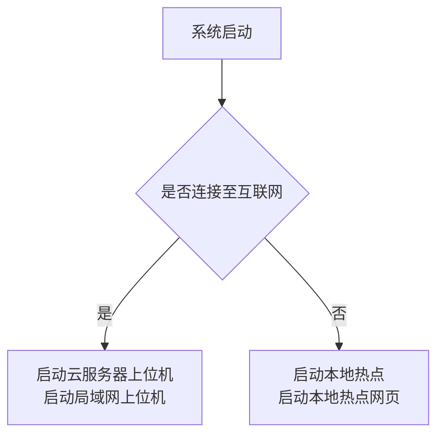
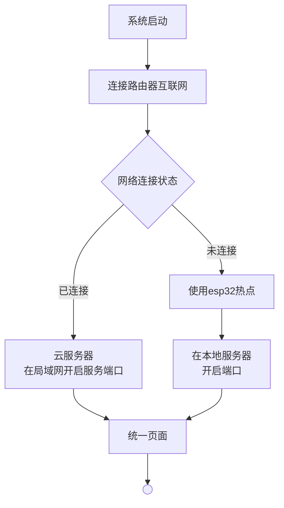

## 1。接线头文件实现
参考dragram.json文件的接线方案，实现inclued/pins.h

备注：温湿度传感器json中为4pin dh22，请保留3pin dh11方案
    实现红外发射器方案，继电器连接设备为电动马达（排气扇）
    设计sg90舵机控制的家居（如窗帘等）

## 2.外部连接功能实现
1. 使用Wi-Fi（home-WiFi）连接网络，使用mqtt协议连接云服务器上位机
2. 实现Wi-Fi（esp32-WiFi）热点广播 
    name：esp32-server
    pass：lbl450981

3. 上位机技术：运行在指定域名的Mosquitto服务

功能示意图：

当网络丢失时，自动启动局域网上位机，并启动局域网上位机网页
每30秒检查一次是否可以连接到互联网，如果可以连接则切换到云服务器上位机模式，否则继续使用本地热点模式。
## 3.设备驱动实现
### 1.传感器功能实现
    实现src/Sensor.cpp，include/Sensor.h
    实现传感器的数据实时获取，在esp32进行统一处理后实现统一接口发出（每种传感器一个接口）
    在cpp文件中实现数据获取的函数，每0.5秒获取一次数据。 
    注意，在Sensor中实现的是类，要求保留pin的接口而不是写死
    实现温湿度传感器（dh22）和光照传感器，火焰传感器和mq2传感器的类，方便在功能实现中实例化调用

### 2.控制器功能实现
    实现src/Controllerr.cpp，include/Controllerr.h
    实现继电器和舵机的控制函数，要求保留pin的接口而不是写死
    继电器控制函数实现开关控制，速度控制，舵机控制函数实现角度（0-180度） 
    实现红外收发器的控制函数，实现红外信号的发送和接收功能（分别实现ir_out,ir_in）
    实现红外信号的编码和解码功能，要求支持常见的红外协议（如NEC协议等）

## 4.功能实现
### 1.传感器数据广播
    实现传感器数据的广播功能，要求每0.5秒获取一次数据，并通过mqtt协议发送到云服务器上位机

    温湿度传感器使用百分比表示当前湿度情况
    传感器使用百分比表示当前光照情况
    烟雾传感器使用绿色，蓝色，黄色，红色来表示当前烟雾浓度的四个等级
    活跃传感器检测是否存在火灾情况。

    数据格式要求为json格式，包含传感器类型、数据值、时间戳等信息
    实现数据的异常处理功能，要求在数据获取失败或异常时能够正确处理并发送错误信息

    实现wifi情况下的传感器数据广播功能，
    要求在连接到home-WiFi与esp32-WiFi热点时都能够正常广播数据
    通过局域网网页面展示传感器数据，要求能够实时更新数据并显示在网页上

功能示意图：

### 2.设备控制功能实现（网页上位机）
    实现设备控制功能，要求能够通过mqtt协议接收云服务器上位机发送的控制指令，并根据指令控制继电器和舵机的状态
    控制指令格式要求为json格式，包含设备类型、控制命令、参数等信息
    实现控制指令的异常处理功能，要求在接收控制指令失败或异常时能够正确处理并发送错误信息

    实现wifi情况下的设备控制功能，
    要求在连接到home-WiFi与esp32-WiFi热点时都能够正常接收控制指令并执行
    通过局域网网页面实现设备控制功能，要求能够通过网页界面发送控制指令并实时显示设备状态

功能内容：
1. 舵机1-舵机2组成的窗帘控制系统，能够在0-180度范围内使用上位机进行无极控制（滑块），同时在关闭-打开的状态下，中间还有四档调节模式。
2. 继电器控制的排气扇，能够实现开关控制和速度控制功能，支持多档调节模式。可以手动在“关闭，弱，中，强”三档模式中调整。
3. 数据显示功能，能够在网页界面上实时显示传感器数据和设备状态，要求数据更新频率为0.5秒一次，并且能够正确显示异常信息。

功能示意图：

### 3.自动处理
1. 根据时间进行自动控制：系统内置时间线程（有网络时同步网络时间，否则根据当前自行计算时间，24小时制），每天早上7点自动打开窗帘，晚上10点自动关闭窗帘
2. 传感器数据情况报警处理：如果M2传感器提示烟雾浓度过高时，自动打开开通风扇并强风力调到最高档位，但浓度超高时，蜂鸣器开始发出短促的报警声。
3. 火焰传感器报警处理：如果火焰传感器检测到火焰存在超过45秒的时候风鸣期发出，短短长的报警声，持续存在超过5分钟的时候，上位机自动消防队发送火灾报警。如果此时处于本地服务器状态则不操作。

# 备注
编码时请保持代码风格的统一与可维护行，注释清晰，变量命名规范，函数设计合理，模块划分清晰，便于后续维护和扩展。
尽可能不要在main.cpp中实现过多的功能逻辑，建议将功能模块化，并通过功能方法类实现，只在main.cpp中进行功程序的启动。
第一个构建版本不用实现云服务器的功能，但应该实现相关接口
